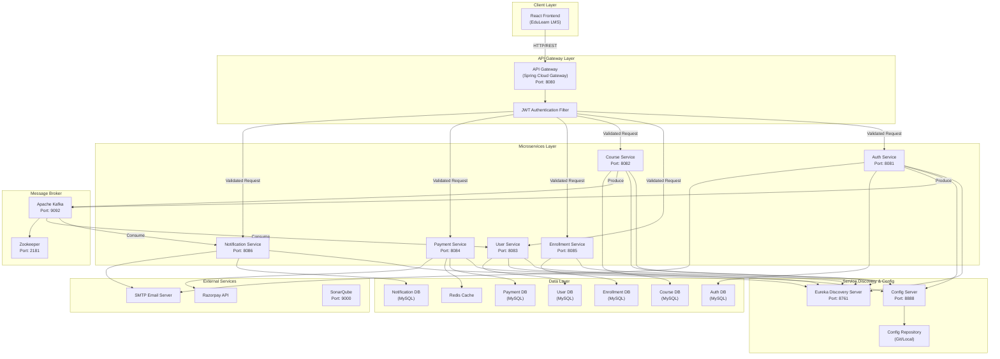

# EduLearn Online Learning Platform — Architecture Diagram

## System Architecture

## Communication Patterns

| Pattern | Source | Destination | Description |
|---------|--------|-------------|-------------|
| Sync REST | Frontend | API Gateway | All client requests |
| Sync REST | API Gateway | Microservices | Routed via Eureka |
| Async Kafka | Auth Service | Notification Service | Welcome/Login emails |
| Async Kafka | Auth Service | User Service | Profile sync |
| Async Kafka | Course Service | Notification Service | Course announcements |
| Sync REST | Payment Service | Razorpay API | Payment processing |
| Sync REST | Payment Service | Enrollment Service | Mark enrollment active |

## Port Mapping

| Service | Port |
|---------|------|
| API Gateway | 8080 |
| Auth Service | 8081 |
| Course Service | 8082 |
| User Service | 8083 |
| Payment Service | 8084 |
| Enrollment Service | 8085 |
| Notification Service | 8086 |
| Eureka Discovery | 8761 |
| Config Server | 8888 |
| Kafka | 9092 |
| SonarQube | 9000 |
| Redis | 6379 |
