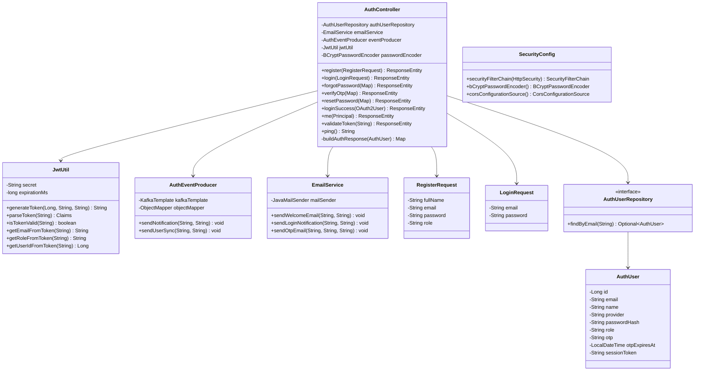
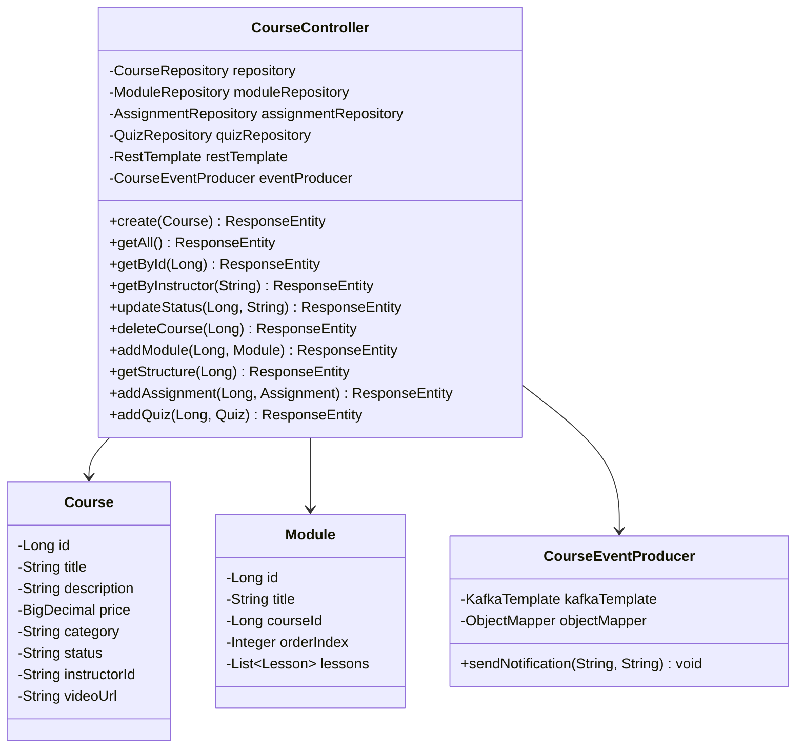
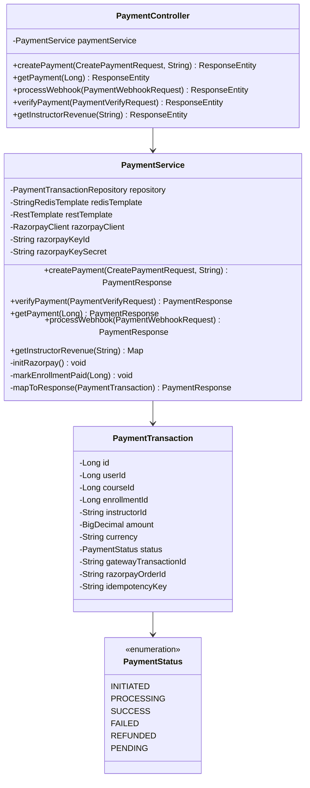

# EduLearn — Class Diagram

## Auth Service — Class Diagram

```mermaid
classDiagram
    class AuthController {
        -AuthUserRepository authUserRepository
        -EmailService emailService
        -AuthEventProducer eventProducer
        -JwtUtil jwtUtil
        -BCryptPasswordEncoder passwordEncoder
        +register(RegisterRequest) ResponseEntity
        +login(LoginRequest) ResponseEntity
        +forgotPassword(Map) ResponseEntity
        +verifyOtp(Map) ResponseEntity
        +resetPassword(Map) ResponseEntity
        +loginSuccess(OAuth2User) ResponseEntity
        +me(Principal) ResponseEntity
        +validateToken(String) ResponseEntity
        +ping() String
        -buildAuthResponse(AuthUser) Map
    }

    class JwtUtil {
        -String secret
        -long expirationMs
        +generateToken(Long, String, String) String
        +parseToken(String) Claims
        +isTokenValid(String) boolean
        +getEmailFromToken(String) String
        +getRoleFromToken(String) String
        +getUserIdFromToken(String) Long
    }

    class AuthEventProducer {
        -KafkaTemplate kafkaTemplate
        -ObjectMapper objectMapper
        +sendNotification(String, String) void
        +sendUserSync(String, String) void
    }

    class EmailService {
        -JavaMailSender mailSender
        +sendWelcomeEmail(String, String) void
        +sendLoginNotification(String, String) void
        +sendOtpEmail(String, String, String) void
    }

    class AuthUser {
        -Long id
        -String email
        -String name
        -String provider
        -String passwordHash
        -String role
        -String otp
        -LocalDateTime otpExpiresAt
        -String sessionToken
    }

    class RegisterRequest {
        -String fullName
        -String email
        -String password
        -String role
    }

    class LoginRequest {
        -String email
        -String password
    }

    class SecurityConfig {
        +securityFilterChain(HttpSecurity) SecurityFilterChain
        +bCryptPasswordEncoder() BCryptPasswordEncoder
        +corsConfigurationSource() CorsConfigurationSource
    }

    class AuthUserRepository {
        <<interface>>
        +findByEmail(String) Optional~AuthUser~
    }

    AuthController --> JwtUtil
    AuthController --> AuthEventProducer
    AuthController --> EmailService
    AuthController --> AuthUserRepository
    AuthController --> RegisterRequest
    AuthController --> LoginRequest
    AuthUserRepository --> AuthUser
```

## Course Service — Class Diagram

```mermaid
classDiagram
    class CourseController {
        -CourseRepository repository
        -ModuleRepository moduleRepository
        -AssignmentRepository assignmentRepository
        -QuizRepository quizRepository
        -RestTemplate restTemplate
        -CourseEventProducer eventProducer
        +create(Course) ResponseEntity
        +getAll() ResponseEntity
        +getById(Long) ResponseEntity
        +getByInstructor(String) ResponseEntity
        +updateStatus(Long, String) ResponseEntity
        +deleteCourse(Long) ResponseEntity
        +addModule(Long, Module) ResponseEntity
        +getStructure(Long) ResponseEntity
        +addAssignment(Long, Assignment) ResponseEntity
        +addQuiz(Long, Quiz) ResponseEntity
    }

    class Course {
        -Long id
        -String title
        -String description
        -BigDecimal price
        -String category
        -String status
        -String instructorId
        -String videoUrl
    }

    class Module {
        -Long id
        -String title
        -Long courseId
        -Integer orderIndex
        -List~Lesson~ lessons
    }

    class CourseEventProducer {
        -KafkaTemplate kafkaTemplate
        -ObjectMapper objectMapper
        +sendNotification(String, String) void
    }

    CourseController --> Course
    CourseController --> Module
    CourseController --> CourseEventProducer
```

## Payment Service — Class Diagram

```mermaid
classDiagram
    class PaymentController {
        -PaymentService paymentService
        +createPayment(CreatePaymentRequest, String) ResponseEntity
        +getPayment(Long) ResponseEntity
        +processWebhook(PaymentWebhookRequest) ResponseEntity
        +verifyPayment(PaymentVerifyRequest) ResponseEntity
        +getInstructorRevenue(String) ResponseEntity
    }

    class PaymentService {
        -PaymentTransactionRepository repository
        -StringRedisTemplate redisTemplate
        -RestTemplate restTemplate
        -RazorpayClient razorpayClient
        -String razorpayKeyId
        -String razorpayKeySecret
        +createPayment(CreatePaymentRequest, String) PaymentResponse
        +verifyPayment(PaymentVerifyRequest) PaymentResponse
        +getPayment(Long) PaymentResponse
        +processWebhook(PaymentWebhookRequest) PaymentResponse
        +getInstructorRevenue(String) Map
        -initRazorpay() void
        -markEnrollmentPaid(Long) void
        -mapToResponse(PaymentTransaction) PaymentResponse
    }

    class PaymentTransaction {
        -Long id
        -Long userId
        -Long courseId
        -Long enrollmentId
        -String instructorId
        -BigDecimal amount
        -String currency
        -PaymentStatus status
        -String gatewayTransactionId
        -String razorpayOrderId
        -String idempotencyKey
    }

    class PaymentStatus {
        <<enumeration>>
        INITIATED
        PROCESSING
        SUCCESS
        FAILED
        REFUNDED
        PENDING
    }

    PaymentController --> PaymentService
    PaymentService --> PaymentTransaction
    PaymentTransaction --> PaymentStatus
```
