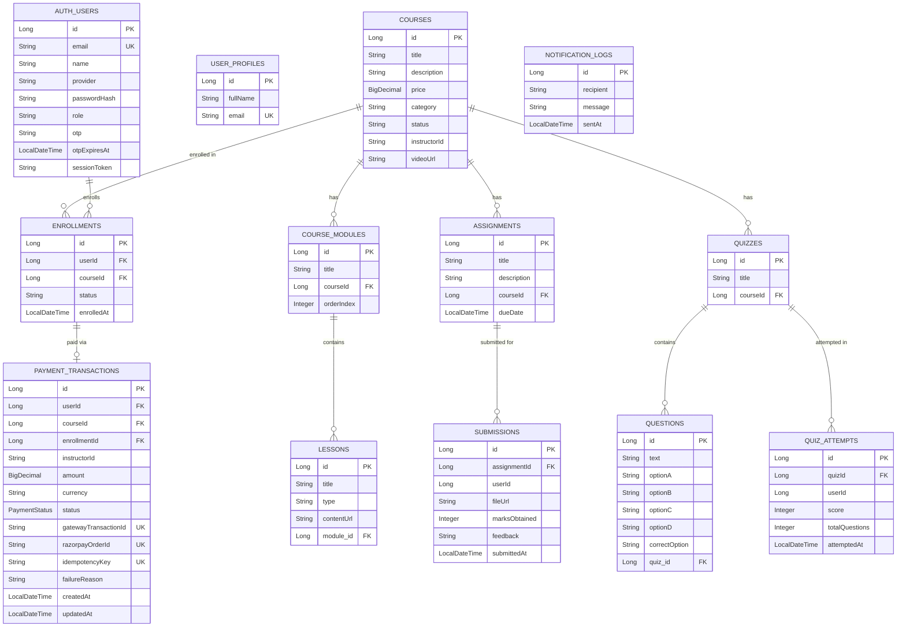

# EduLearn — Entity Relationship Diagram

## Full ER Diagram

## Database-per-Service Mapping

| Service | Database | Tables |
|---------|----------|--------|
| Auth Service | auth_db | auth_users |
| User Service | user_db | user_profiles |
| Course Service | course_db | courses, course_modules, lessons, assignments, quizzes, questions |
| Enrollment Service | enrollment_db | enrollments, submissions, quiz_attempts |
| Payment Service | payment_db | payment_transactions |
| Notification Service | notification_db | notification_logs |
