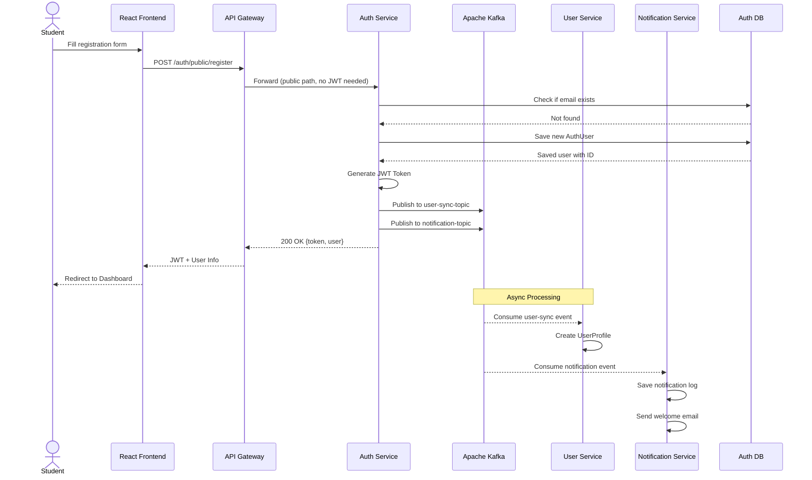
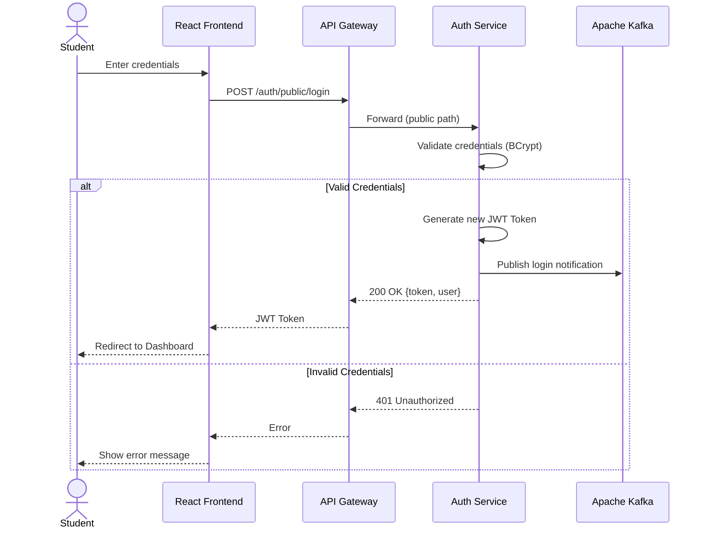
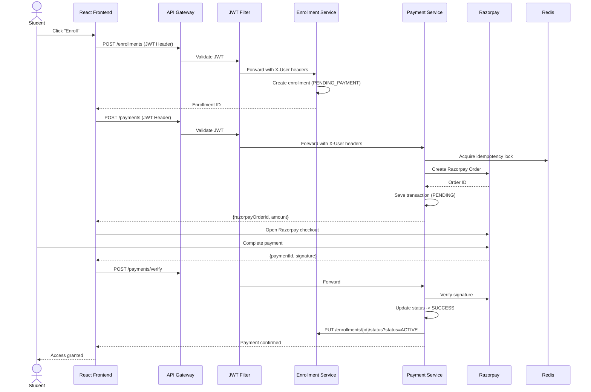
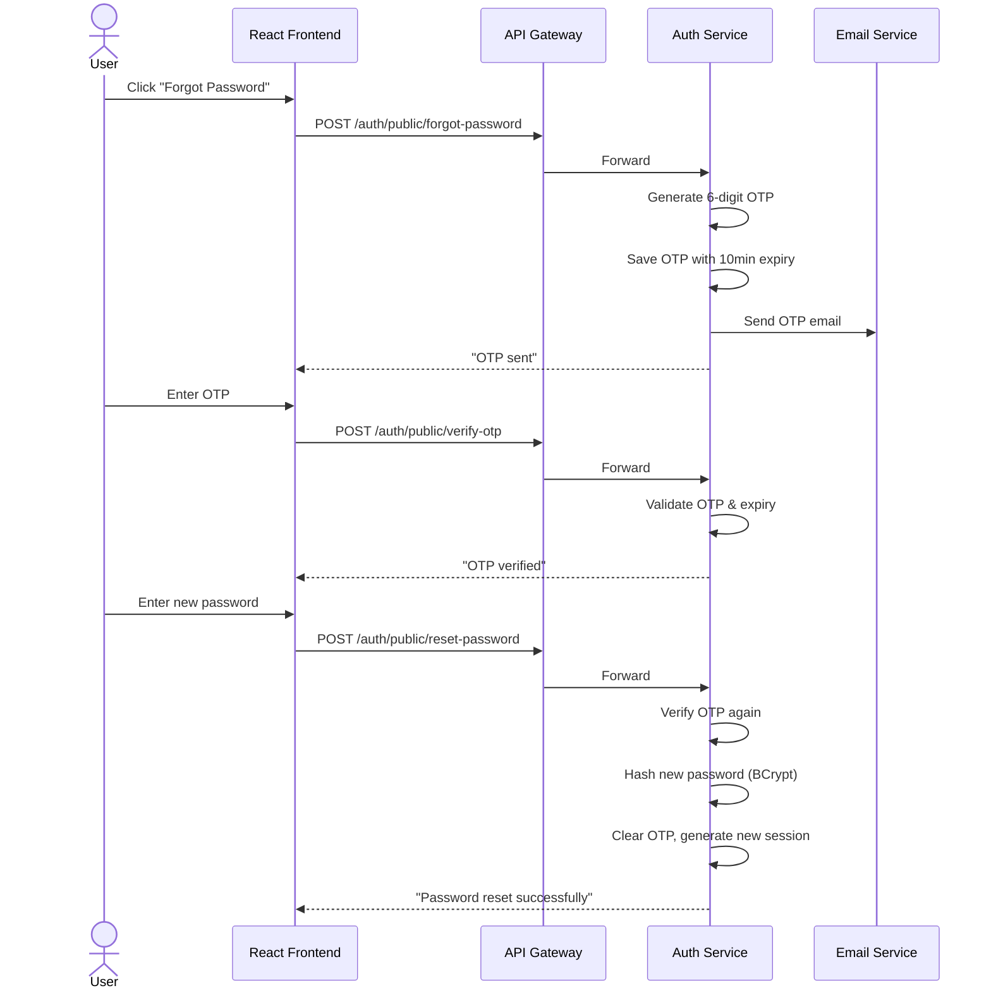
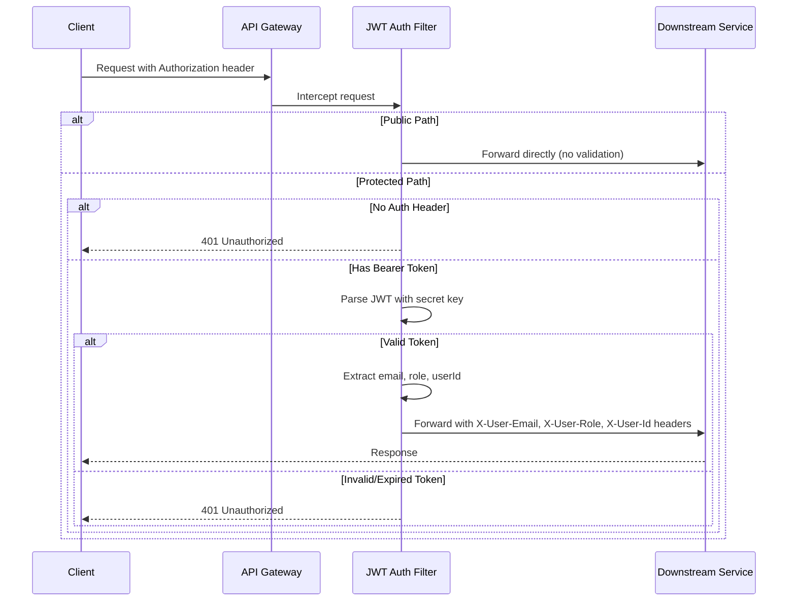

# EduLearn — Sequence Diagrams

## 1. User Registration Flow

## 2. User Login Flow

## 3. Course Enrollment & Payment Flow

## 4. Forgot Password / OTP Flow

## 5. API Gateway JWT Validation Flow

