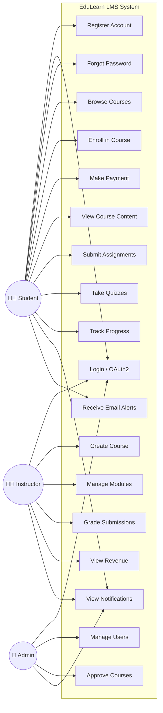
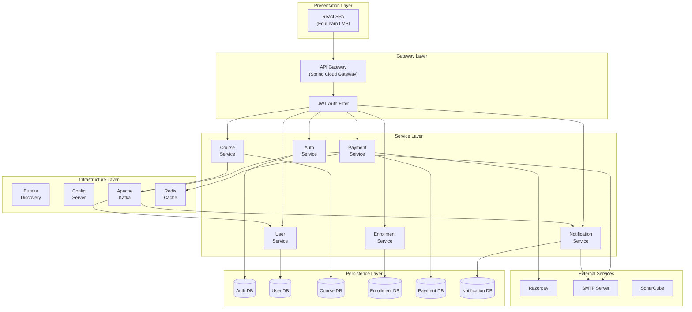
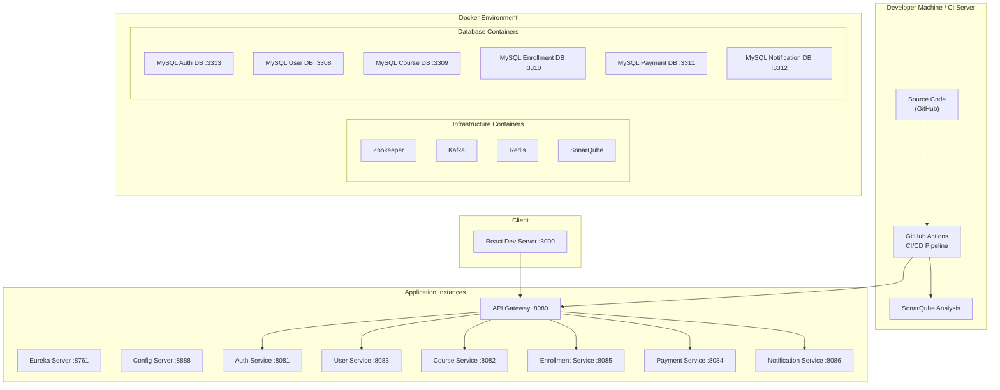

# EduLearn — Use Case Diagram

## System Use Cases

```mermaid
graph LR
    subgraph "EduLearn LMS System"
        UC1["Register Account"]
        UC2["Login / OAuth2"]
        UC3["Forgot Password"]
        UC4["Browse Courses"]
        UC5["Enroll in Course"]
        UC6["Make Payment"]
        UC7["View Course Content"]
        UC8["Submit Assignments"]
        UC9["Take Quizzes"]
        UC10["Track Progress"]
        UC11["Create Course"]
        UC12["Manage Modules"]
        UC13["Grade Submissions"]
        UC14["View Revenue"]
        UC15["Manage Users"]
        UC16["Approve Courses"]
        UC17["View Notifications"]
        UC18["Receive Email Alerts"]
    end

    Student(("👨‍🎓 Student"))
    Instructor(("👨‍🏫 Instructor"))
    Admin(("🔑 Admin"))

    Student --> UC1
    Student --> UC2
    Student --> UC3
    Student --> UC4
    Student --> UC5
    Student --> UC6
    Student --> UC7
    Student --> UC8
    Student --> UC9
    Student --> UC10
    Student --> UC17
    Student --> UC18

    Instructor --> UC2
    Instructor --> UC11
    Instructor --> UC12
    Instructor --> UC13
    Instructor --> UC14
    Instructor --> UC17

    Admin --> UC2
    Admin --> UC15
    Admin --> UC16
    Admin --> UC17
```

## Component Diagram

```mermaid
graph TB
    subgraph "Presentation Layer"
        REACT["React SPA<br/>(EduLearn LMS)"]
    end

    subgraph "Gateway Layer"
        APIGW["API Gateway<br/>(Spring Cloud Gateway)"]
        JWTF["JWT Auth Filter"]
    end

    subgraph "Service Layer"
        direction LR
        AS["Auth<br/>Service"]
        US["User<br/>Service"]
        CS["Course<br/>Service"]
        ES["Enrollment<br/>Service"]
        PS["Payment<br/>Service"]
        NS["Notification<br/>Service"]
    end

    subgraph "Infrastructure Layer"
        EUR["Eureka<br/>Discovery"]
        CFG["Config<br/>Server"]
        KFK["Apache<br/>Kafka"]
        RDS["Redis<br/>Cache"]
    end

    subgraph "Persistence Layer"
        DB1[("Auth DB")]
        DB2[("User DB")]
        DB3[("Course DB")]
        DB4[("Enrollment DB")]
        DB5[("Payment DB")]
        DB6[("Notification DB")]
    end

    subgraph "External Services"
        RPAY["Razorpay"]
        MAIL["SMTP Server"]
        SQ["SonarQube"]
    end

    REACT --> APIGW
    APIGW --> JWTF
    JWTF --> AS
    JWTF --> US
    JWTF --> CS
    JWTF --> ES
    JWTF --> PS
    JWTF --> NS

    AS --> DB1
    US --> DB2
    CS --> DB3
    ES --> DB4
    PS --> DB5
    NS --> DB6

    AS --> KFK
    CS --> KFK
    KFK --> NS
    KFK --> US

    PS --> RDS
    PS --> RPAY
    AS --> MAIL
    NS --> MAIL
```

## Deployment Diagram

```mermaid
graph TB
    subgraph "Developer Machine / CI Server"
        SRC["Source Code<br/>(GitHub)"]
        GHA["GitHub Actions<br/>CI/CD Pipeline"]
        SQ["SonarQube Analysis"]
    end

    subgraph "Docker Environment"
        subgraph "Infrastructure Containers"
            ZK["Zookeeper"]
            KFK["Kafka"]
            RDS["Redis"]
            SQC["SonarQube"]
        end

        subgraph "Database Containers"
            DB1["MySQL Auth DB :3313"]
            DB2["MySQL User DB :3308"]
            DB3["MySQL Course DB :3309"]
            DB4["MySQL Enrollment DB :3310"]
            DB5["MySQL Payment DB :3311"]
            DB6["MySQL Notification DB :3312"]
        end
    end

    subgraph "Application Instances"
        EUR["Eureka Server :8761"]
        CFG["Config Server :8888"]
        GW["API Gateway :8080"]
        A["Auth Service :8081"]
        U["User Service :8083"]
        C["Course Service :8082"]
        E["Enrollment Service :8085"]
        P["Payment Service :8084"]
        N["Notification Service :8086"]
    end

    subgraph "Client"
        FE["React Dev Server :3000"]
    end

    SRC --> GHA
    GHA --> SQ
    GHA --> GW

    FE --> GW
    GW --> A
    GW --> U
    GW --> C
    GW --> E
    GW --> P
    GW --> N
```
